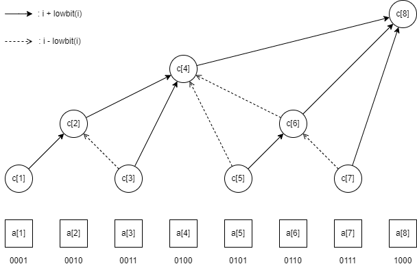

# Fenwick Tree

$$
c_i = \sum_{i - lowbit(i) + 1}^i a_i
$$

<figure><figcaption><p>Fenwick Tree</p></figcaption></figure>


```cpp
// 1-based index
template <typename T = i64>
struct Fenwick
{
    using Size  = int;
    using Index = int;

    static Index lowbit(const Index x)
    {
        return x & -x;
    }

    Size           n;
    std::vector<T> c;

    Fenwick(Size n)
        : n(n), c(n + 1)
    {
    }

    template <typename Iter>
    Fenwick(Iter first, Iter last)
        : n(last - first), c(n + 1)
    {
        for (int i = 1; i <= n; i++)
        {
            c[i] += *(first++);
            if (i + lowbit(i) <= n)
            {
                c[i + lowbit(i)] += c[i];
            }
        }
    }

    void add(Index p, T v)
    {
        assert(0 < p && p <= n);
        for (; p <= n; p += lowbit(p))
        {
            c[p] += v;
        }
    }

    T sum(Index p) const
    {
        assert(0 <= p && p <= n);
        T res = 0;
        for (; p; p -= lowbit(p))
        {
            res += c[p];
        }
        return res;
    }
    T sum(Index l, Index r) const
    {
        return sum(r) - sum(l - 1);
    }
    T sum() const
    {
        return sum(n);
    }

    // 找到最大的p使sum(p)<=s
    Index bsearch(T s)
    {
        Index pos = 0;
        for (int i = std::__lg(n); i >= 0; i--)
        {
            if (pos + (1 << i) <= n && c[pos + (1 << i)] <= s)
            {
                pos += (1 << i);
                s -= c[pos];
            }
        }
        return pos;
    }
};
```



```cpp
// 1-based index
template <typename T = i64>
struct DiffFenwick
{
    using Size  = int;
    using Index = int;

    Size       n;
    Fenwick<T> b, bi;

    DiffFenwick(Size n)
        : n(n), b(n + 1), bi(n + 1)
    {
    }

    void add(Index l, Index r, T v)
    {
        b.add(l, v);
        b.add(r + 1, -v);
        bi.add(l, v * l);
        bi.add(r + 1, -v * (r + 1));
    }
    T sum(Index p) const
    {
        return (p + 1) * b.sum(p) - bi.sum(p);
    }
    T sum(Index l, Index r) const
    {
        return sum(r) - sum(l - 1);
    }
    T sum() const
    {
        return sum(n);
    }
    T get(Index p) const
    {
        return b.sum(p);
    }
};
```



```cpp
// 1-based index
template <typename T = i64>
struct TwoDFenwick
{
    using Size  = int;
    using Index = int;

    static Index lowbit(const Index x)
    {
        return x & -x;
    }

    Size                        n, m;
    std::vector<std::vector<T>> c;

    TwoDFenwick(Size n, Size m)
        : n(n), m(m), c(n + 1, std::vector<T>(m + 1))
    {
    }

    void add(Index x, Index y, T v)
    {
        for (Index i = x; i <= n; i += lowbit(i))
        {
            for (Index j = y; j <= m; j += lowbit(j))
            {
                c[i][j] += v;
            }
        }
    }

    T sum(Index x, Index y)
    {
        T s = 0;
        for (Index i = x; i; i -= lowbit(i))
        {
            for (Index j = y; j; j -= lowbit(j))
            {
                s += c[i][j];
            }
        }
        return s;
    }
};
```

