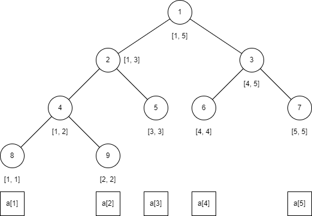

# Segment Tree

<figure><figcaption><p>Segment Tree</p></figcaption></figure>

<pre class="language-cpp" data-title="普通线段树" data-line-numbers><code class="lang-cpp">// 1-based indexing
template &#x3C;typename Info>
struct SegmentTree
{
    using Size    = int;
    using Index   = int;
    using NodePtr = int;

    const Size        n;
    std::vector&#x3C;Info> node;

    SegmentTree(std::vector&#x3C;Info> init)
        : SegmentTree(init.size() - 1)
    {
        build(1, 1, n, init);
    }

    void modify(Index x, const Info &#x26;info)
    {
        modify(1, 1, n, x, info);
    }

    Info query(Index ql, Index qr)
    {
        return query(1, 1, n, ql, qr);
    }

  private:
    SegmentTree(Size n)
        : n(n), node(4 &#x3C;&#x3C; std::__lg(n))
    {
    }

    void update(NodePtr p)
    {
        node[p] = Info::merge(node[2 * p], node[2 * p + 1]);
    }

    void build(NodePtr p, Index l, Index r, const std::vector&#x3C;Info> &#x26;init)
    {
        if (l == r)
        {
            node[p] = init[l];
            return;
        }

        Index m = (l + r) / 2;
        build(2 * p, l, m, init);
        build(2 * p + 1, m + 1, r, init);
        update(p);
<strong>    }
</strong>
    void modify(NodePtr p, Index l, Index r, const Index x, const Info &#x26;info)
    {
        if (l == r)
        {
            node[p] = info;
            return;
        }

        Index m = (l + r) / 2;
        (x &#x3C;= m) ? modify(2 * p, l, m, x, info)
                 : modify(2 * p + 1, m + 1, r, x, info);

        update(p);
    }

    Info query(NodePtr p, Index l, Index r, Index ql, Index qr)
    {
        if (l == ql &#x26;&#x26; r == qr)
        {
            return node[p];
        }

        Index m = (l + r) / 2;
        if (qr &#x3C;= m)
        {
            return query(2 * p, l, m, ql, qr);
        }
        else if (m + 1 &#x3C;= ql)
        {
            return query(2 * p + 1, m + 1, r, ql, qr);
        }
        else
        {
            return Info::merge(query(2 * p, l, m, ql, m),
                               query(2 * p + 1, m + 1, r, m + 1, qr));
        }
    }
};

struct Info
{
    static Info merge(const Info &#x26;lInfo, const Info &#x26;rInfo)
    {
    }
};
</code></pre>


```cpp
// 1-based indexing
template <typename Info, typename Tag>
struct LazySegmentTree
{
    using Size    = int;
    using NodePtr = int;
    using Index   = int;

    const Size        n;
    std::vector<Info> node;
    std::vector<Tag>  tag;

    LazySegmentTree(std::vector<Info> init)
        : LazySegmentTree(init.size() - 1)
    {
        build(1, 1, n, init);
    }

    void apply(Index ql, Index qr, const Tag &t)
    {
        apply(1, 1, n, ql, qr, t);
    }

    Info query(Index ql, Index qr)
    {
        return query(1, 1, n, ql, qr);
    }

    void modify(Index x, const Info &info)
    {
        modify(1, 1, n, x, info);
    }

  private:
    LazySegmentTree(Size n)
        : n(n), node(4 << std::__lg(n)), tag(4 << std::__lg(n))
    {
    }

    void update(NodePtr p)
    {
        node[p] = Info::merge(node[2 * p], node[2 * p + 1]);
    }

    void apply(NodePtr p, const Tag &t)
    {
        node[p].apply(t);
        tag[p].apply(t);
    }

    void pushdown(NodePtr p)
    {
        apply(2 * p, tag[p]);
        apply(2 * p + 1, tag[p]);
        tag[p] = Tag();
    }

    void build(NodePtr p, Index l, Index r, const std::vector<Info> &init)
    {
        if (l == r)
        {
            node[p] = init[l];
            return;
        }

        Index m = (l + r) / 2;
        build(2 * p, l, m, init);
        build(2 * p + 1, m + 1, r, init);
        update(p);
    }

    void apply(NodePtr p, Index l, Index r, const Index ql, const Index qr, const Tag &t)
    {
        if (r < ql || qr < l)
        {
            return;
        }
        if (ql <= l && r <= qr)
        {
            apply(p, t);
            return;
        }

        pushdown(p);

        Index m = (l + r) / 2;
        apply(2 * p, l, m, ql, qr, t);
        apply(2 * p + 1, m + 1, r, ql, qr, t);

        update(p);
    }

    Info query(NodePtr p, Index l, Index r, Index ql, Index qr)
    {
        if (l == ql && r == qr)
        {
            return node[p];
        }

        pushdown(p);

        Index m = (l + r) / 2;
        if (qr <= m)
        {
            return query(2 * p, l, m, ql, qr);
        }
        else if (m + 1 <= ql)
        {
            return query(2 * p + 1, m + 1, r, ql, qr);
        }
        else
        {
            return Info::merge(query(2 * p, l, m, ql, m),
                               query(2 * p + 1, m + 1, r, m + 1, qr));
        }
    }

    void modify(NodePtr p, Index l, Index r, const Index x, const Info &info)
    {
        if (l == r)
        {
            node[p] = info;
            return;
        }

        pushdown(p);

        Index m = (l + r) / 2;
        (x <= m) ? modify(2 * p, l, m, x, info)
                 : modify(2 * p + 1, m + 1, r, x, info);

        update(p);
    }
};

struct Tag
{
    Tag() //! 构造和pushdown会使用默认构造
    {
    }
    Tag() // 有参构造
    {
    }
    void apply(const Tag &t)
    {
    }
};
struct Info
{
    static Info merge(const Info &lInfo, const Info &rInfo)
    {
    }
    void apply(const Tag &t)
    {
    }
};
```



```cpp
// 找到第一个使 f(info) 为 true 的下标
Index bsearch(Index ql, Index qr, std::function<bool(Info)> f)
{
    return bsearch(1, 1, n, ql, qr, f);
}

Index bsearch(NodePtr p, Index l, Index r, Index ql, Index qr, std::function<bool(Info)> f)
{
    if (l == ql && r == qr)
    {
        if (!f(node[p]))
        {
            return -1;
        }

        if (l == r)
        {
            return l;
        }

        Index m = (l + r) / 2;
        return f(node[p * 2])
                    ? bsearch(p * 2, l, m, ql, m, f)
                    : bsearch(p * 2 + 1, m + 1, r, m + 1, qr, f);
    }

    pushdown(p); // Lazy

    Index m = (l + r) / 2;
    if (qr <= m)
    {
        return bsearch(p * 2, l, m, ql, qr, f);
    }
    else if (m + 1 <= ql)
    {
        return bsearch(p * 2 + 1, m + 1, r, ql, qr, f);
    }
    else
    {
        int res = bsearch(p * 2, l, m, ql, m, f);
        return (res == -1)
                    ? bsearch(p * 2 + 1, m + 1, r, m + 1, qr, f)
                    : res;
    }
}
```



```cpp
template <typename Info,
          typename Tag,
          std::size_t Capacity>
struct DynamicLazySegmentTree
{
    using Index   = int;
    using NodePtr = int;

    DynamicLazySegmentTree(Index down, Index up)
        : DOWN(down), UP(up), node(), poolPtr(0), root(newNode())
    {
    }
    void apply(Index l, Index r, const Tag &t)
    {
        apply(root, DOWN, UP, l, r, t);
    }
    Info query(Index l, Index r)
    {
        return query(root, DOWN, UP, l, r);
    }
    void modify(Index pos, const Info &info)
    {
        modify(root, DOWN, UP, pos, info);
    }

  private:
    const Index DOWN, UP;
    Index       curL, curR;

    struct Node
    {
        NodePtr lPtr, rPtr;
        Info    info;
        Tag     tag;
    };
    std::array<Node, Capacity> node;
    std::size_t                poolPtr;
    NodePtr                    root;

    NodePtr newNode()
    {
        return poolPtr++;
    }

    void update(NodePtr p)
    {
        const auto lPtr = node[p].lPtr;
        const auto rPtr = node[p].rPtr;

        node[p].info =
            Info::merge(node[lPtr].info,
                        node[rPtr].info,
                        curL, curR);
    }

    void apply(NodePtr p, const Tag &t, int l, int r)
    {
        node[p].info.apply(t, l, r);
        node[p].tag.apply(t, l, r);
    }

    void pushdown(NodePtr p)
    {
        auto &lPtr = node[p].lPtr;
        auto &rPtr = node[p].rPtr;

        if (!lPtr)
        {
            lPtr = newNode();
            rPtr = newNode();
        }

        auto      &tag = node[p].tag;
        const auto m   = (curL + curR - 1) / 2;

        apply(lPtr, tag, curL, m);
        apply(rPtr, tag, m + 1, curR);

        tag = Tag();
    }

    void apply(NodePtr p, Index l, Index r, Index ql, Index qr, const Tag &t)
    {
        curL = l;
        curR = r;

        if (r < ql || qr < l)
        {
            return;
        }
        if (ql <= l && r <= qr)
        {
            apply(p, t, l, r);
            return;
        }

        pushdown(p);

        const auto lPtr = node[p].lPtr;
        const auto rPtr = node[p].rPtr;
        const auto m    = (l + r - 1) / 2;

        apply(lPtr, l, m, ql, qr, t);
        apply(rPtr, m + 1, r, ql, qr, t);

        update(p);
    }

    Info query(NodePtr p, Index l, Index r, Index ql, Index qr)
    {
        curL = l;
        curR = r;

        if (l == ql && r == qr)
        {
            return node[p].info;
        }

        pushdown(p);

        const auto lPtr = node[p].lPtr;
        const auto rPtr = node[p].rPtr;
        const auto m    = (l + r - 1) / 2;

        if (qr <= m)
        {
            return query(lPtr, l, m, ql, qr);
        }
        else if (m + 1 <= ql)
        {
            return query(rPtr, m + 1, r, ql, qr);
        }
        else
        {
            return Info::merge(query(lPtr, l, m, ql, m),
                               query(rPtr, m + 1, r, m + 1, qr),
                               curL, curR);
        }
    }

    void modify(NodePtr p, Index l, Index r, Index pos, const Info &info)
    {
        curL = l;
        curR = r;

        if (l == r)
        {
            node[p].info = info;
            return;
        }

        pushdown(p);

        const auto lPtr = node[p].lPtr;
        const auto rPtr = node[p].rPtr;
        const auto m    = (l + r - 1) / 2;

        if (pos <= m)
        {
            modify(lPtr, l, m, pos, info);
        }
        else
        {
            modify(rPtr, m + 1, r, pos, info);
        }

        update(p);
    }
};

struct Tag
{
    Tag()
    {
    }
    Tag() // 有参构造
    {
    }
    void apply(const Tag &t, int l, int r)
    {
    }
};
struct Info
{
    Info()
    {
    }
    Info() // 有参构造
    {
    }
    static Info merge(const Info &lInfo, const Info &rInfo, int l, int r)
    {
    }
    void apply(const Tag &t, int l, int r)
    {
    }
};
```

