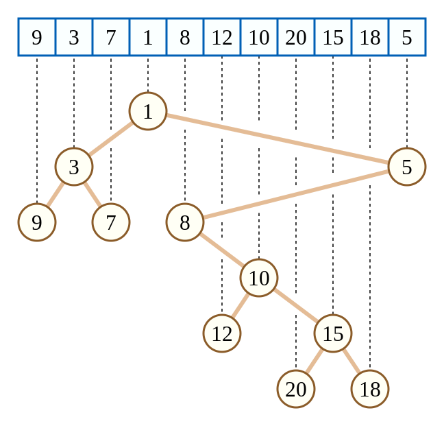

# Cartesian Tree

<figure><figcaption><p>Cartesian Tree</p></figcaption></figure>


```cpp
// 1-based indexing
// return {root, child}
auto getCartesianTree(const std::vector<int> &A)
{
    const int N = A.size() - 1;

    int         rt = 0;
    std::vector chi(N + 1, std::array{0, 0});

    std::stack<int> stk;
    for (int i = 1; i <= N; i++)
    {
        int lastpop = 0;
        while (!stk.empty() && A[stk.top()] > A[i])
        {
            lastpop = stk.top();
            stk.pop();
        }
        stk.size() ? chi[stk.top()][1] = i : rt = i;
        chi[i][0] = lastpop;
        stk.push(i);
    }

    return std::tuple{rt, chi};
}
```


将序列 RMQ 问题转化为树上问题

对于一个点，其左边区间的最值是它的左儿子，其右边区间的最值是它的右儿子。

由一个节点向下看，一个点的子树就是以这个点为最值的极长区间。

由一个节点向上看，第一次左拐的节点是开始节点左边区间 RMQ，第一次右拐的节点是开始节点右边区间 RMQ。

两个节点的 LCA 就是区间 RMQ。
